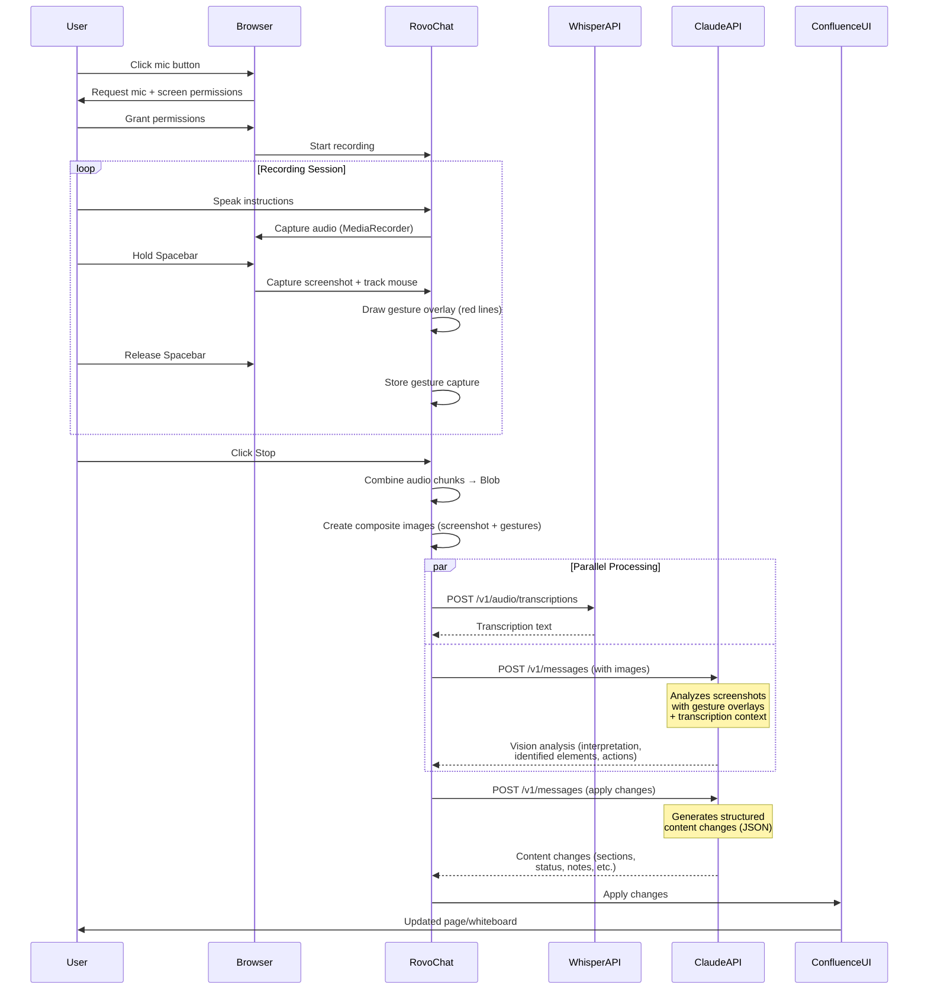

# Rovo Voice - Confluence Voice + Gesture Interface

A proof-of-concept for voice and gesture-based interaction with Confluence pages, using **real Claude Vision API** and **real OpenAI Whisper API** to understand user intent through spoken instructions and visual gestures.

## Overview

Rovo Voice enables natural, multimodal interaction with Confluence pages. Users can speak their intentions while pointing at specific UI elements, and the system intelligently combines:

- **Voice transcription** (OpenAI Whisper) - What the user said
- **Visual gesture analysis** (Claude Vision) - Where the user pointed
- **Contextual understanding** - What needs to change on the page

The system then automatically applies the requested changes to Confluence pages or whiteboards.

## Architecture & Flow



## How It Works

### 1. Recording Phase

When the user clicks the microphone button:

1. **Microphone Access**: Requests audio stream via `getUserMedia()`

   - Uses high-quality settings (44.1kHz, echo cancellation, noise suppression)
   - Records using `MediaRecorder` API with WebM/Opus codec

2. **Screen Capture**: Requests screen share via `getDisplayMedia()`

   - Captures the entire screen or specific window
   - Creates a hidden video element to capture frames

3. **Gesture Capture**: While recording, user can:
   - **Hold Spacebar**: Captures a screenshot of the current screen state
   - **Move Mouse**: Tracks cursor position to create a gesture path
   - **Release Spacebar**: Ends the gesture capture
   - Can repeat multiple times to highlight different areas

### 2. Processing Phase

After stopping the recording:

#### Step 1: Audio Transcription (OpenAI Whisper)

- **API**: `https://api.openai.com/v1/audio/transcriptions`
- **Model**: `whisper-1`
- **Input**: Audio blob (WebM/MP4 format)
- **Output**: Transcribed text + duration
- **Implementation**: See `services/api.ts::transcribeAudio()`

#### Step 2: Visual Gesture Analysis (Claude Vision)

- **API**: `https://api.anthropic.com/v1/messages`
- **Model**: `claude-sonnet-4-20250514`
- **Input**:
  - Base64-encoded images (screenshots with gesture overlays)
  - Transcription text (for context)
  - Page context (current page title/type)
- **Process**:
  1. Each gesture capture is processed:
     - Screenshot is loaded into a canvas
     - Gesture path is drawn as red lines/circles
     - Start point (green) and end point (red) are marked
     - Composite image is exported as base64 JPEG
  2. All composite images are sent to Claude Vision
  3. Claude analyzes what UI elements the user pointed at
- **Output**:
  - Interpretation of user intent
  - Identified UI elements
  - Suggested concrete actions
  - First-person statement of what Rovo will do
- **Implementation**: See `services/api.ts::analyzeImagesWithClaude()`

#### Step 3: Change Application (Claude)

- **API**: `https://api.anthropic.com/v1/messages`
- **Model**: `claude-sonnet-4-20250514`
- **Input**:
  - User intent interpretation
  - Suggested actions
  - Current page/whiteboard content (JSON)
  - Page type (page vs whiteboard)
- **Output**: Structured JSON with changes:
  - Page content updates (sections, table rows, status)
  - Whiteboard note additions/removals
- **Implementation**: See `services/api.ts::applyChangesWithClaude()`

### 3. Application Phase

The generated changes are applied to the Confluence UI:

- Page content updates (sections, status badges, table rows)
- Whiteboard note additions/removals
- Real-time UI updates via React state

## Technical Implementation

### Browser APIs

| API                   | Purpose           | Usage                                       |
| --------------------- | ----------------- | ------------------------------------------- |
| `getUserMedia()`      | Microphone access | Audio recording with quality constraints    |
| `getDisplayMedia()`   | Screen capture    | Screenshot capture for gesture overlays     |
| `MediaRecorder`       | Audio recording   | Captures audio chunks, exports as Blob      |
| Canvas API            | Image processing  | Draws gesture overlays on screenshots       |
| Mouse/Keyboard events | Gesture tracking  | Tracks cursor position during Spacebar hold |

### External APIs

#### OpenAI Whisper API

- **Endpoint**: `POST https://api.openai.com/v1/audio/transcriptions`
- **Authentication**: Bearer token (API key)
- **Request Format**: `multipart/form-data` with audio file
- **Response**: JSON with `text` and `duration` fields
- **Rate Limits**: Based on OpenAI account tier
- **Cost**: Pay-per-use based on audio duration

#### Anthropic Claude Vision API

- **Endpoint**: `POST https://api.anthropic.com/v1/messages`
- **Authentication**: `x-api-key` header
- **Model**: `claude-sonnet-4-20250514`
- **Request Format**: JSON with base64 images + text prompt
- **Response**: JSON with structured interpretation
- **Rate Limits**: Based on Anthropic account tier
- **Cost**: Pay-per-use based on tokens

### Gesture Overlay Rendering

The gesture overlay system (`RovoChat.tsx::createGestureOverlay()`):

1. **Screenshot Capture**: When Spacebar is pressed, captures current video frame to canvas
2. **Path Tracking**: Records mouse coordinates during Spacebar hold
3. **Overlay Drawing**:
   - Red stroke (`#FF5630`) with 4px width
   - Green start point (`#36B37E`, 8px radius)
   - Red end point (`#FF5630`, 8px radius)
   - Shadow effect for visibility
4. **Export**: Converts canvas to base64 JPEG (80% quality)

### State Management

- **Recording State**: Tracks recording status, duration, gesture captures
- **Processing State**: Manages async API calls and UI feedback
- **Message History**: Stores conversation with Rovo
- **Page Content**: React state for Confluence page/whiteboard data

## Setup

### Prerequisites

- Node.js 18+ and Yarn
- Modern browser with WebRTC support (Chrome, Edge, Firefox)
- API keys:
  - **OpenAI API Key**: From [platform.openai.com](https://platform.openai.com)
  - **Anthropic API Key**: From [console.anthropic.com](https://console.anthropic.com)

### Installation

```bash
# Install dependencies
yarn install

# Start development server
yarn dev

# Build for production
yarn build
```

### Configuration

1. **Start the app** and open Rovo Chat (sidebar on the right)
2. **Click the ⚙️ Settings icon** in the chat header
3. **Enter your API keys**:
   - Claude API Key (for vision analysis)
   - OpenAI API Key (for Whisper transcription)
4. Keys are stored in `localStorage` (client-side only)

**Note**: Without API keys, the app falls back to simulated responses for demo purposes.

## Usage

### Basic Flow

1. **Open Rovo Chat**: Click the chat icon or it opens automatically
2. **Start Recording**: Click the 🎤 microphone button
3. **Grant Permissions**: Allow microphone and screen sharing access
4. **Speak & Gesture**:
   - Speak your instructions clearly
   - Hold **Spacebar** and move your mouse to point at UI elements
   - Release Spacebar when done with a gesture
   - Repeat for multiple areas if needed
5. **Stop Recording**: Click the Stop button
6. **Watch Processing**:
   - Transcription appears first
   - Vision analysis follows
   - Rovo shows what it will do
   - Changes are applied automatically

### Example Interactions

**Page Content Update**:

- Say: _"Change the status to complete and update the due dates"_
- Gesture: Point at the status badge and due date field
- Result: Status changes to "COMPLETE", dates updated

**Whiteboard Note Addition**:

- Say: _"Add a sticky note about action items from today's meeting"_
- Gesture: Point at an empty area of the whiteboard
- Result: New sticky note appears with the content

## Project Structure

```
rovo-voice/
├── src/
│   ├── components/
│   │   ├── ConfluenceShell.tsx    # Main layout (header + sidebar)
│   │   ├── PageTree.tsx           # Navigation tree component
│   │   ├── PageContent.tsx        # Confluence page renderer
│   │   ├── Whiteboard.tsx         # Collaborative whiteboard
│   │   ├── RovoChat.tsx           # AI chat sidebar with recording
│   │   ├── ApiKeyModal.tsx        # API key configuration UI
│   │   └── RovoIcon.tsx           # Rovo branding icon
│   ├── services/
│   │   └── api.ts                 # API integration layer
│   │       ├── transcribeAudio()           # OpenAI Whisper
│   │       ├── analyzeImagesWithClaude()   # Claude Vision
│   │       └── applyChangesWithClaude()    # Claude content generation
│   ├── App.tsx                    # Root component & state
│   ├── main.tsx                   # Entry point
│   └── index.css                  # Atlassian design tokens
├── public/
│   └── confluence.svg            # Assets
├── package.json
├── vite.config.ts
└── README.md
```

## API Integration Details

### OpenAI Whisper Integration

```typescript
// services/api.ts
export async function transcribeAudio(
  audioBlob: Blob,
  apiKey: string
): Promise<TranscriptionResult> {
  const formData = new FormData();
  formData.append("file", audioBlob, "recording.webm");
  formData.append("model", "whisper-1");
  formData.append("response_format", "verbose_json");

  const response = await fetch(
    "https://api.openai.com/v1/audio/transcriptions",
    {
      method: "POST",
      headers: { Authorization: `Bearer ${apiKey}` },
      body: formData,
    }
  );

  const data = await response.json();
  return { text: data.text, duration: data.duration || 0 };
}
```

### Claude Vision Integration

```typescript
// services/api.ts
export async function analyzeImagesWithClaude(
  images: string[], // base64 encoded with gesture overlays
  transcription: string,
  pageContext: string,
  apiKey: string
): Promise<VisionAnalysisResult> {
  const imageContents = images.map((img) => ({
    type: "image" as const,
    source: {
      type: "base64" as const,
      media_type: "image/jpeg" as const,
      data: img.replace(/^data:image\/\w+;base64,/, ""),
    },
  }));

  const response = await fetch("https://api.anthropic.com/v1/messages", {
    method: "POST",
    headers: {
      "Content-Type": "application/json",
      "x-api-key": apiKey,
      "anthropic-version": "2023-06-01",
      "anthropic-dangerous-direct-browser-access": "true",
    },
    body: JSON.stringify({
      model: "claude-sonnet-4-20250514",
      max_tokens: 1024,
      messages: [
        {
          role: "user",
          content: [
            ...imageContents,
            {
              type: "text",
              text: `You are Rovo, Atlassian's AI assistant...
                   [Analysis prompt with transcription and page context]`,
            },
          ],
        },
      ],
    }),
  });

  // Parse JSON response with interpretation, elements, actions
}
```

## Limitations & Notes

- **Client-Side Only**: This is a prototype, not production-ready
- **API Key Storage**: Keys stored in `localStorage` (not secure for production)
- **Screen Sharing**: Captures entire display, not just browser window
- **Browser Compatibility**: Works best in Chrome/Edge with full permissions
- **Cost**: Real API usage incurs costs (Whisper + Claude Vision)
- **Rate Limits**: Subject to API provider rate limits
- **Privacy**: Audio and screenshots are sent to external APIs

## Future Enhancements

- [ ] Server-side API proxy for secure key management
- [ ] Support for browser-only screen capture (not full display)
- [ ] Gesture recognition improvements (circles, boxes, etc.)
- [ ] Multi-language support
- [ ] Voice feedback from Rovo (text-to-speech)
- [ ] Undo/redo for applied changes
- [ ] Batch processing for multiple pages

## License

This is a proof-of-concept demonstration project.
